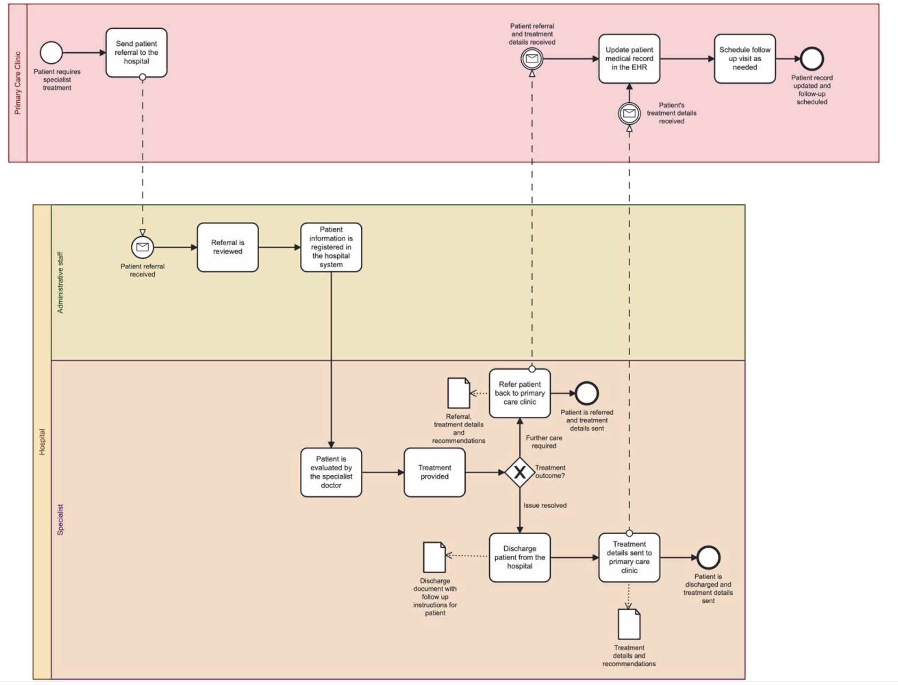

  <h1>BPMN Model</h1>
  

[Home](index.md) || [BPMN Model](bpmn.md) || [Use Case Model](use_case.md) || [ETL Pipeline](etl_documentation.md) || [Insights](insights.md) || [Team Contributions](team_contributions.md) || [About](about.md)

## BPMN Diagram

## Explanation
The BPMN diagram represents the flow of sequence for a patient referral management system between a primary care clinic and a hospital. The diagram consists of two pools, the primary care clinic and the hospital. The hospital pool is divided into two lanes, the administrative staff and the specialist. A start event is indicated in the primary care clinic indicating the patient’s need for a specialist treatment, which results in the primary care clinic sending a referral to the hospital. The patient referral is received by the admin staff in the hospital pool which starts the event of that pool and further reviewed, after which the patient’s information is registered in the hospital’s system. The patient is evaluated by the specialist and treatment is provided, an exclusive gateway is used to explain the treatment outcomes indicating the need for further treatment and a referral back to the primary care clinic or issue resolved case and discharge. The task of referring patient back to primary care clinic also includes the referral and treatment details sent while the discharge patient task contains the patient discharge instructions, linked to a task requiring the hospital to also send the treatment details to the primary care clinic. The referral sent back to the primary care clinic and treatment recommendations regardless of the treatment outcome is updated in the patient’s EHR, both information received from the two different outcomes is required to be updated in the EHR. Based on the recommendations and information received, the primary care clinic schedules patient’s follow-up visit as needed.

