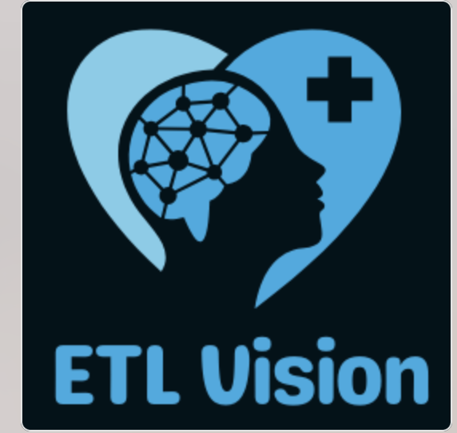
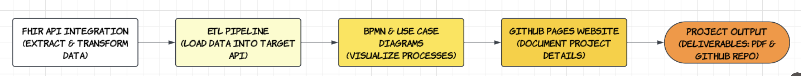
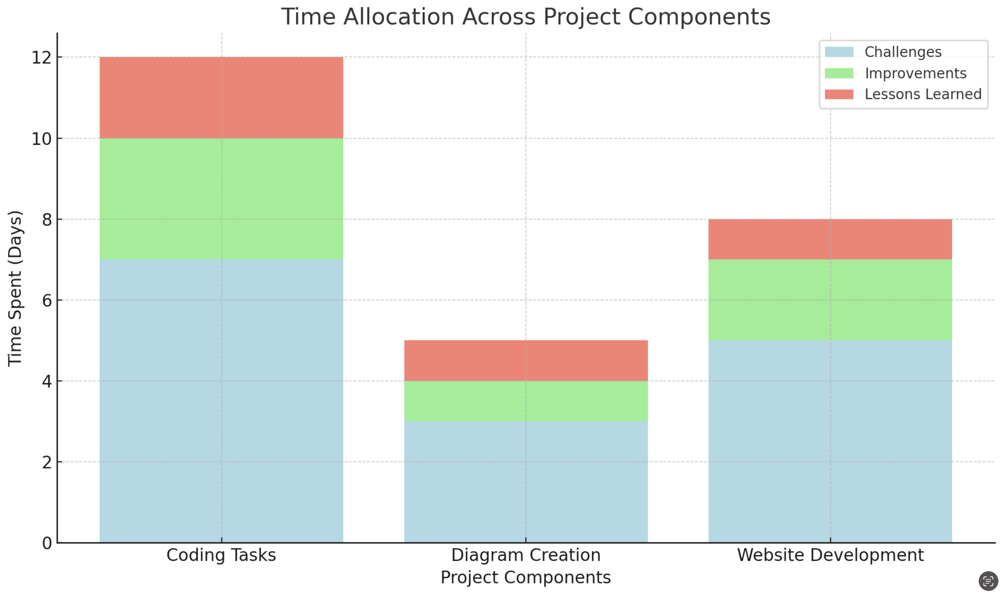

  <h1>Insights</h1>
  

[Home](index.md) || [BPMN Model](bpmn.md) || [Use Case Model](use_case.md) || [ETL Pipeline](etl_documentation.md) || [Insights](insights.md) || [Team Contributions](team_contributions.md) || [About](about.md)

## Key Insights Gained from the Project

- We learned how FHIR APIs work and their importance in healthcare data exchange. This gave us a better understanding of how standardized data can improve patient care and interoperability.
 
- By working on coding tasks, we gained hands-on experience with Python and APIs. This helped us understand how to extract, transform, and load healthcare data efficiently into an EHR system.
  
- Creating diagrams like the BPMN model and the use case diagram gave us a clear understanding of how data and processes flow between primary care and hospitals. These visuals made it easier to explain complex workflows.
  
- Building a project website using GitHub Pages improved our ability to organize and present technical information professionally. It also showed us how documentation is essential for effective communication in team projects.

## Challenges Faced

- Coding Tasks: Handling API complexities, like managing tokens and fixing errors during data extraction or loading, was tricky. Debugging and logging errors helped us resolve these issues.
  
- Data Transformation: Cleaning and formatting data to match FHIR standards was challenging, especially with incomplete or inconsistent data. Automating the process with Python scripts made it easier.
  
- Diagram Creation: It took time to ensure the BPMN and use case diagrams were clear and accurate. Proper collaboration and research helped us create meaningful diagrams.
  
- Website Development: Designing a visually appealing GitHub Pages website required extra effort. We experimented with themes and layouts to make the site user-friendly and professional.

## Lessons Learned
 
- Teamwork and communication are key to completing a group project successfully. Dividing tasks based on individual strengths made our workflow smoother.
  
- Effective documentation, both in code and on the website, is crucial for explaining complex processes to others.
  
- Visuals like diagrams and graphs are powerful tools for simplifying technical concepts and making them easier to understand.
  
- Automation and standardization, such as using Python scripts and FHIR standards, save time and reduce errors in managing healthcare data.

## Potential Improvements

- We could improve error handling in the coding tasks by adding more detailed logging and fallback mechanisms.
  
- The website design could be enhanced further by adding interactive elements or advanced visuals.
  
- Including additional use cases in the BPMN model and use case diagram would make the project even more comprehensive.
  
- Using more advanced data visualization tools could provide deeper insights into the extracted data.

## Reflections

Working on this project as a team was a valuable experience. Each of us brought different skills to the table, and we learned a lot from one another. This project not only improved our technical abilities but also taught us the importance of planning, communication, and attention to detail. Overall, it was a rewarding experience that showed us how technology can solve real-world problems in healthcare.

